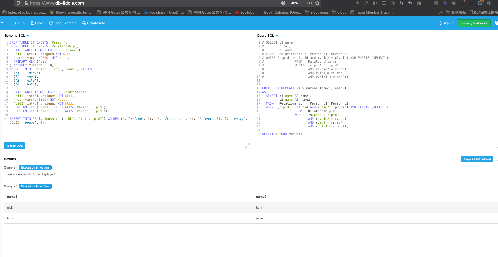

# SQL for Querying Mutual Relatiopnship

## Description
Consider a social network database, about people and their relationships.  The database has two relations:

```
	Person(pid, name)
	Relationship(pid1, rel, pid2)
```

Here `Person.pid` is a key, and `Relationship.pid1` and `Relationship.pid2` are foreign keys;`rel` is a string representing the relation type, and can be `friend` or `enemy`.  
Note that the relationship is not necessarily symmetric:  if Alice is friend with Bob, this does not imply that Bob is friend with Alice.

## Question
>
1. Q1: Create a view called `mutual` that contains pairs of people who share mutual feelings for each other (i.e., they consider each other friends or enemies). 
The schema of your view should be mutual(name1,name2). Note that your view should not repeat the same pair of people in different order (e.g.,`(Alice,Bob)` and `(Bob,Alice)`); 
your view should only keep the pair, such that the name with the lowest ·pid· appears first.

## Solution

### Schema and Test Data
```
DROP TABLE IF EXISTS `Person`;
DROP TABLE IF EXISTS `Relationship`;
CREATE TABLE IF NOT EXISTS `Person` (
  `pid` int(6) unsigned NOT NULL,
  `name` varchar(200) NOT NULL,
  PRIMARY KEY (`pid`)
) DEFAULT CHARSET=utf8;
INSERT INTO `Person` (`pid`, `name`) VALUES
  ('1',  'nick'),
  ('2', 'tom'),
  ('3', 'mike'),
  ('4', 'bob');

CREATE TABLE IF NOT EXISTS `Relationship` (
  `pid1` int(6) unsigned NOT NULL,
  `rel` varchar(200) NOT NULL,
  `pid2` int(6) unsigned NOT NULL,
  FOREIGN KEY (`pid1`) REFERENCES `Person` (`pid`),
  FOREIGN KEY (`pid2`) REFERENCES `Person` (`pid`));

INSERT INTO `Relationship` (`pid1`, `rel`, `pid2`) VALUES (1, 'friend', 2), (2, 'friend', 1), (1, 'friend', 3), (3, 'enemy', 2),(2, 'enemy', 3); 
```

### SQL Query
```
CREATE OR REPLACE VIEW mutual (name1, name2)
AS
  SELECT p1.name AS name1,
         p2.name AS name2
  FROM   Relationship r, Person p1, Person p2
  WHERE (r.pid1 = p1.pid and r.pid2 = p2.pid) AND EXISTS (SELECT *
                 FROM   Relationship rs
                 WHERE  rs.pid1 = r.pid2
                        AND rs.pid2 = r.pid1
                        AND r.rel = rs.rel
                        AND r.pid1 < r.pid2);

SELECT * FROM mutual;
```
### Test in DB-Fiddle

